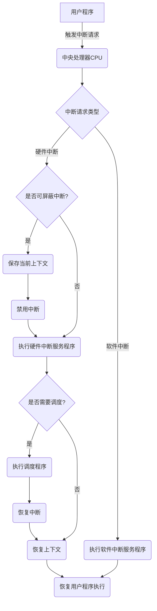

## 2-1什么是操作系统虚拟机？

操作系统虚拟机是一种软件或硬件实现，它允许在一个操作系统中运行多个虚拟的操作系统实例。它创建了一个隔离的、虚拟的计算环境，每个虚拟机都可以运行其自己的操作系统，并在该环境中执行应用程序。

## 2-4 什么是管态？什么是用户态？二者有何区别？为什么要区分处理机所谓态？

管态和用户态是指处理器运行的不同权限级别

管态下，操作系统拥有最高的特权级别和访问权限，可以执行特权指令，访问所有硬件设备和系统资源，并具有对内存和外部设备的完全控制

用户态下，应用程序和用户进程运行，只能访问被授权的资源和执行非特权指令，用户无法直接访问硬件设备，需要调用接口进行访问

通过区分处理机的不同态，操作系统可以提供对系统资源的保护、隔离和管理，同时提高系统的安全性、稳定性和性能

## 2-12 什么是向量中断？什么是中断向量？

向量中断是一种中断处理的机制，它使用预定义的中断向量来识别和处理不同类型的中断事件。在向量中断机制中，每个中断类型被分配一个唯一的中断向量，用于指示中断事件的类型和处理程序的入口点

中断向量是一个与中断类型相关联的数值，通常是一个整数。当中断事件发生时，硬件或操作系统将中断向量发送给处理器，以便确定要执行的中断处理程序的位置。中断处理程序是事先定义好的，用于处理特定类型的中断事件

## 2-10画出中断响应过程？

## 3-5 用户与操作系统的接口是什么？一个分时系统提供什么接口？一个批处理系统又提供什么接口？

系统调用函数

命令行界面 图形用户界面 应用程序编程接口

批处理语言 批处理作业控制文件 系统日志和报告

## 3-8 什么是系统调用？对操作系统的服务请求与一般的子程序调用有什么区别？

系统调用是操作系统提供给用户程序的一种接口，用于允许用户程序请求操作系统的服务和执行特权操作

区别

- 特权级别

  操作系统运行在特权模式下，具有更高的权限和访问权，可以执行特权操作，而用户程序运行在用户模式下，权限受到限制，无法直接执行特权操作。系统调用提供了一种机制，允许用户程序通过调用操作系统提供的特定函数来请求执行特权操作

- 安全性

  操作系统通过系统调用来实现对资源的保护和安全控制

- 上下文切换

  当用户程序发起系统调用请求时，操作系统需要进行上下文切换

  上下文切换是指从用户模式切换到特权模式，将用户程序的执行状态保存起来，并切换到操作系统的执行环境中，在系统调用执行完毕后，操作系统会恢复用户程序的执行状态，继续执行用户程序

