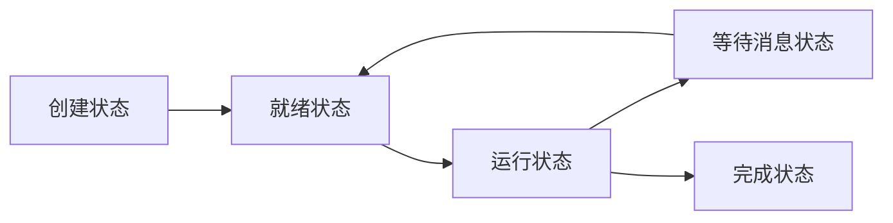

## 4-3

### 什么是进程？

程序执行过程中的实例

### 进程与程序的主要区别是什么？

程序是静态的，它们只是存储在磁盘上的文件。进程是动态的，它们在计算机的内存中运行，并且可以执行操作、改变状态和与其他进程进行通信

## 4-9

### 什么原因会导致发生变迁2、变迁3、变迁4 ？

变迁2 分配的时间片用尽

变迁3 请求I/O或其他系统调用 进程必须等待

变迁4 等待结束

### 在什么情况下，一个进程的变迁3 能立即引起另一个进程发生变迁1 ？

一个进程变迁3 进入等待 释放了CPU空间，因此另一个进程变迁1，得到CPU空间，开始运行

###  下列因果变迁是否可能发生？若可能，需要什么条件？

题目中好像没给

## 4-10

### 某系统进程 状态除了3个最基本状态外，又增加了创建状态、完成状态、因等消息而转变为等待状态3种新的状态，试画出增加新状态后的进程状态变迁图，并说明发生每一个变迁的原因。



1. 创建状态到就绪状态：当操作系统接收到一个新的进程创建请求时，进程从创建状态转换到就绪状态。这表示操作系统已经为进程分配了必要的资源，并且该进程已准备好被调度执行。
2. 就绪状态到运行状态：当调度算法选择该进程并分配处理器时间片时，进程从就绪状态转换到运行状态。这表示该进程当前正在执行指令。
3. 运行状态到等待消息状态：当进程执行过程中遇到需要等待某个特定消息或事件的情况时，进程从运行状态转换到等待消息状态。例如，进程可能需要等待输入/输出完成、锁释放或其他进程发送的消息。
4. 等待消息状态到就绪状态：当等待的消息或事件到达时，进程从等待消息状态转换回就绪状态。这表示等待的条件已满足，进程可以继续执行。
5. 运行状态到完成状态：当进程执行完所有指令或达到了预定的终止条件时，进程从运行状态转换到完成状态。这表示该进程的任务已经完成，并且不再需要继续执行。

## 4-12

设置互斥信号灯mutex,初值是1,表示公共变量Q未被运用。

```c++
Main( ){

	Int mutex=1;

	// Cobegin

	P1( );

    P2( );

    :

    :

    Pn( );

    // Coend

}

P1( ){

    :

    P(mutex);

    访问Q;

    V(mutex);

    :

}

P2( )

    {

    :

    P(mutex);

    访问Q;

    V(mutex);

    :

}

    :

    :

Pn( ){

    :

    P(mutex);

    访问Q;

    V(mutex);

    :

}
```

假设mutex=1,表示没有进程进入临界区;

假设mutex=0,表示有一个进程进入临界区访问Q;

假设mutex=-i,{i取值1~〔n-1〕},表示有一个进程进入临界区,有i个进程在等待进入临界区访问Q。

## 4-13

### a

P1 ....        .....          V(S12)  V(S13)  V(S14)

P2  P(S12)

P3  P(S13)

P4  P(S14)

### b

P1 ....        .....          V(S13)

P2 .....       ....           V(S23)

P3   P(S13)  P(S23)

## 4-16

互斥（Mutual Exclusion）是指通过某种机制，保证在同一时刻只有一个进程可以访问共享资源，其他进程必须等待。互斥的目的是防止多个进程同时对共享资源进行写操作，避免数据的不一致性和冲突。常见的互斥机制包括使用信号灯、互斥锁等。

同步（Synchronization）是指多个进程之间协调和控制彼此的行为，使得它们按照一定的顺序执行，以达到预期的结果。同步的目的是确保多个进程在访问共享资源时按照特定的顺序进行操作，避免数据的竞争和错误。常见的同步机制包括使用信号量、条件变量、屏障等。

- 联系：互斥和同步都是为了解决并发执行时可能出现的问题，确保多个进程之间的正确协作。它们都涉及到对共享资源的访问和操作。
- 区别：互斥关注的是多个进程对共享资源的互斥访问，保证在同一时刻只有一个进程可以访问共享资源；而同步关注的是多个进程之间的协调和顺序执行，确保它们按照特定的顺序进行操作。互斥主要解决并发写操作的问题，而同步主要解决进程之间的协作和顺序的问题。

## 4-22

线程（Thread）是操作系统调度的基本单位，是进程中的一个实体。一个进程可以包含多个线程，每个线程都是独立执行的，有自己的执行路径和执行状态。线程是进程中的实际执行者，负责执行进程中的代码

区别：

1. 资源占用：进程是操作系统分配资源的基本单位，每个进程都拥有独立的地址空间、文件描述符、打开的文件等资源。而线程是进程中的执行者，线程共享进程的大部分资源，包括地址空间、文件描述符等。因此，创建和切换线程的开销比创建和切换进程的开销要小。
2. 执行特性：每个进程都有独立的执行序列，进程可以独立执行不同的程序段。而线程是进程中的执行者，同一个进程的多个线程共享相同的代码段，可以同时执行不同的函数或方法。
3. 多任务方式：进程是能够独立运行的任务实体，可以独立进行调度和执行。而线程是进程中的执行者，多个线程共享进程的资源，可以实现多个线程的并发执行，通过线程切换实现多任务。
4. 通信方式：进程通信需要使用操作系统提供的进程间通信机制，如管道、消息队列、共享内存等。而线程之间可以通过共享内存的方式进行通信，直接读写共享变量即可。

## 4-29

假设空闲位置数量的信号量为`emptySeats`，初始值为5，表示长凳上有5个空闲位置。坐下的人数信号量为`occupiedSeats`，初始值为0，表示长凳上没有人坐下。

游客进入公园后，遵循以下操作：

当游客想要坐下时：

```
P(emptySeats) // 申请一个空闲位置
P(occupiedSeats) // 坐下后，已坐下的人数增加
// 进行坐下操作
```

当游客离开长凳时：

```
V(emptySeats) // 释放一个空闲位置
V(occupiedSeats) // 已坐下的人数减少
// 离开长凳
```